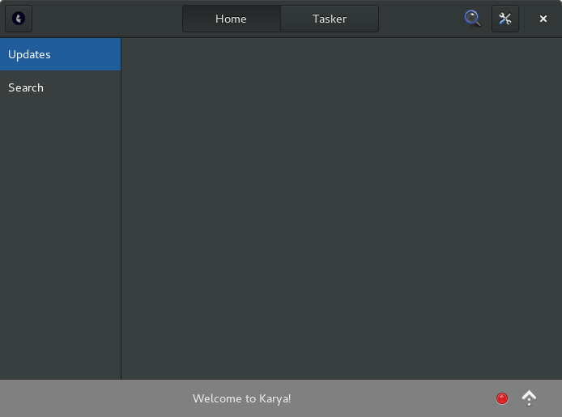
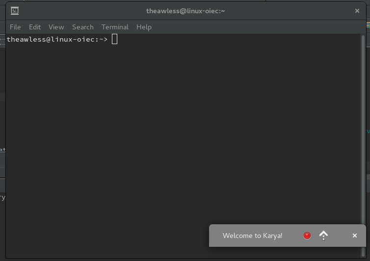
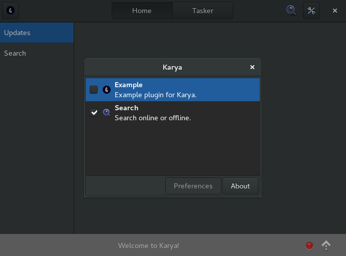

# Karya
A voice-controlled assistant for Linux.

### Aim
* Control everything using voice control or hand gestures.
* Render keyboards and mice useless.

### Features
- [ ] Voice control
    - [ ] Open/close apps
    - [ ] Emulate mouse
    - [ ] Emulate Keyboard
    - [ ] Change, minimize windows
    - [ ] Change menus
    - [x] Clipboard  
- [x] Plugin system using libpeas
- [x] Dictate text anywhere
  say `start dictation` and then onwards type the spoken words
- [ ] Integration with GNOME shell calender
- [ ] Notifications
- [ ] Sudo access lets you set tasks (recurring and periodic)
  the tasker mode, don't have much use for this right now
- [ ] A customized homepage showing important notifications
  the home mode, show news, maybe recent updates, facebook
- [x] Beautiful, follows GNOME human guidelines

* * *

### Screenshots
* Large window 

* Small window mode

* Small window docked to terminal

* Plugin Support

* * *

### Plugins
- [ ] Text templates plugin  
  example: say `insert joke` to fetch joke online and write it

- [ ] Add more commands plugin  
  so that user can enter his own speech keyword and can associate commands/scripts with it  
  example: say `my keyword` to run myscript.sh

- [x] Gedit plugin
    - [x] [Dictation Plugin for gedit](https://github.com/theawless/Dict-O-nator)
    - [ ] inbuilt editor

- [ ] Search for files locally/on web  
  integrate with search on shell

- [ ] Ask questions to google  
  using webkit?

- [ ] Rhythmbox plugin  
  rhythmbox client supports shell commands like --pause

- [ ] Facebook plugin  
  show recent updates on home page

- [ ] Calculator  

### Scope
* Natural Language Processing
* Use of intents
    witai?
* Use of hand gestures to control mouse
* Eye gaze tracker to control mouse

* * *
### Requirements
* [Zhang, A.(2016) Speech Recognition](https://github.com/Uberi/speech_recognition)
* [CMU Sphinx (Version 4 and higher)](http://cmusphinx.sourceforge.net/)
* [PocketSphinx Python Wrappers](https://github.com/cmusphinx/pocketsphinx)

### Attributes
Plugin system in libpeas  
[lzone.de](http://lzone.de/How+to+write+GObject+Introspection+based+Plugins)

text2num library  
License: MIT  
[text2num by Greg Hewgill](https://github.com/ghewgill/text2num)

### License
Karya is released under **GNU GPL v3**

See LICENSE to read the terms of the GNU General Public License  
You can also visit <http://www.gnu.org/licenses/> to read the terms.
